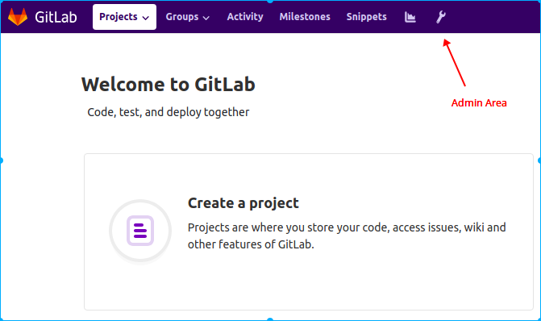
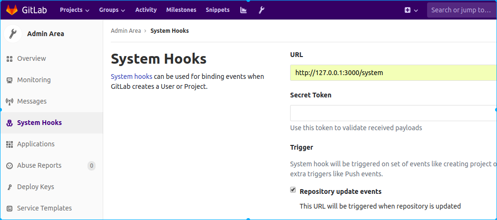
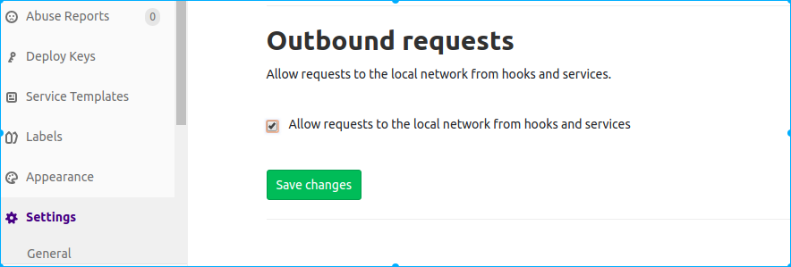
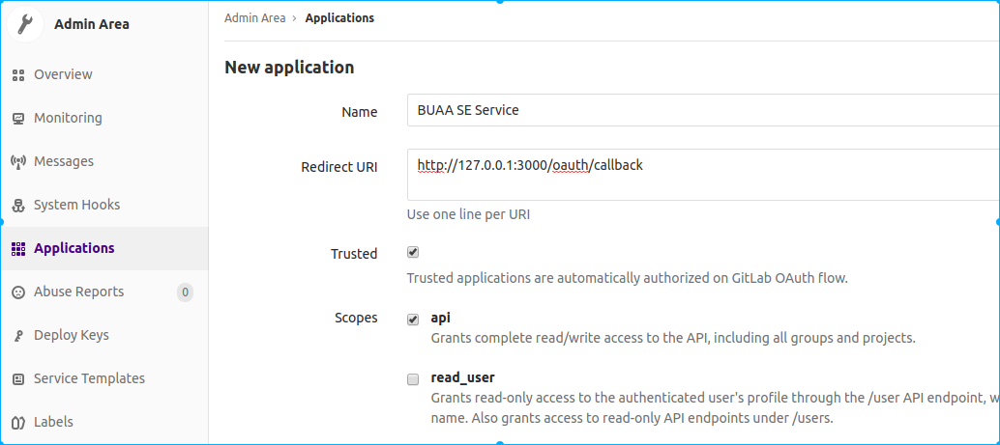

# 安装配置指南(Ubuntu14.04)

## Ruby 版本
  2.3+ (不要使用系统ruby版本，可以使用rvm安装)
## 依赖
### sshd
sshd 用于 git
```shell
sudo apt install openssh-server
```
### GitLab
安装GitLab
#### 安装依赖
```shell
sudo apt-get install -y curl ca-certificates
```
#### 添加GitLab仓库并安装
##### 官方源安装
添加仓库
```shell
curl -sS https://packages.gitlab.com/install/repositories/gitlab/gitlab-ce/script.deb.sh | sudo bash
```
安装，EXTERNAL_URL设置为GitLab实例Url
```shell
sudo EXTERNAL_URL="http://gitlab.ce" apt-get install gitlab-ce
```
##### 清华源安装
信任 GitLab 的 GPG 公钥:
```shell
curl https://packages.gitlab.com/gpg.key 2> /dev/null | sudo apt-key add - &>/dev/null
```
写入软件源， 编辑/etc/apt/sources.list.d/gitlab-ce.list，添加：
```shell
deb https://mirrors.tuna.tsinghua.edu.cn/gitlab-ce/ubuntu trusty main
```
更新软件源并安装
```shell
sudo apt update
sudo EXTERNAL_URL="http://gitlab.ce" apt-get install gitlab-ce
```
完成后打开 http://gitlab.ce 或 http://127.0.0.1 设置密码即可

## 配置
### GitLab配置
#### 配置 System Hook
* 以管理员账户登录GitLab，进入Admin Area
  
* 配置System Hook， 填写本服务Url，添加即可
  
#### 配置管理员 Access Token
进入root用户设置页，添加Access Token，务必勾选api

#### 允许添加 localhost webhook
进入Admin Area 设置页面，勾选 Allow requests to the local network from hooks and services

#### 添加 OAuth 应用
进入 Admin Area Applications 页面，添加应用，务必勾选api



### 本服务配置
配置GitLab地址和本服务地址，如：
```ruby
GitLabHost = 'http://gitlab.ce'.freeze
TeachHost = 'http://127.0.0.1:3000'.freeze
```
配置管理员Access Token，如：
```ruby
PRIVATE_TOKEN = 'yuppYSiMdMQn7A5MLX8z'.freeze
```
将上面配置 OAuth Application 得到的 Application ID，secret 和 Callback URL
写入配置文件，如：
```ruby
APP_ID = 'd0272f9ec2c0f63e3922b1d4484aad5b01189a718b1bb1a4bc0af91c6f9d262f'.freeze
APP_SECRET = '527da804ad9b6b2cb82afa63a2524fce1cc3a29ec95980e244787f941c6876ca'.freeze
REDIRECT_URI = "#{TeachHost}/oauth/callback".freeze
```

### GitLab Runners 配置
#### 安装 GitLab Runner
```shell
curl -L https://packages.gitlab.com/install/repositories/runner/gitlab-runner/script.deb.sh | sudo bash
sudo apt-get install gitlab-runner
```
#### 注册 GitLab Runner(Shared Runner)
参考 https://docs.gitlab.com/runner/register/index.html

### 数据库
默认使用 Sqlite
数据库初始化: rails db:migrate

### 部署
todo

# issue 状态说明
状态有四种：
- Open
- To Do
- Doing
- Closed

其中Open代表To Do或Doing
所有新建Issue和重新打开的Issue状态初始为To Do
Issue 状态可在To Do, Doing, Closed 之间任意跳转
